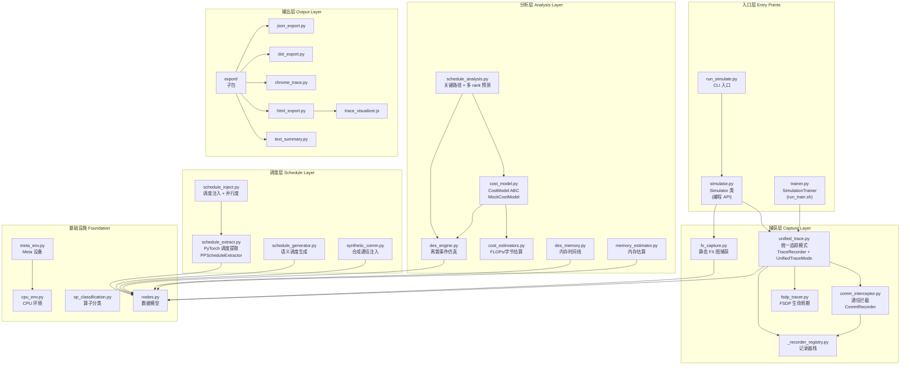
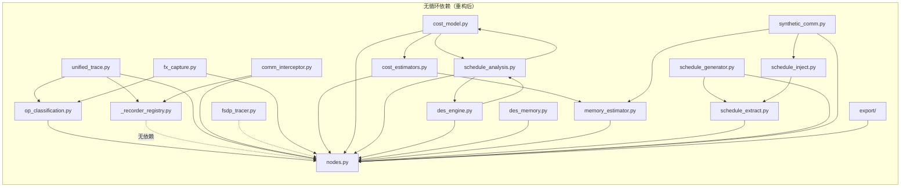
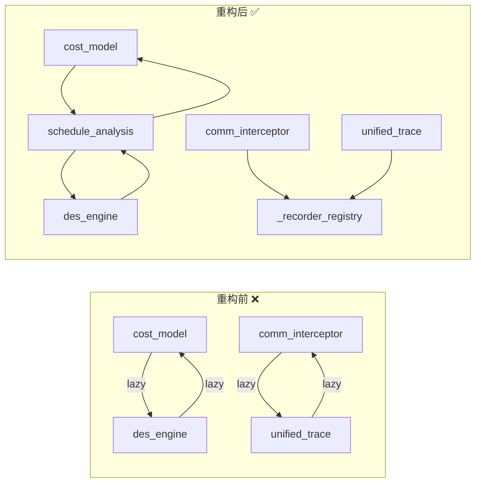
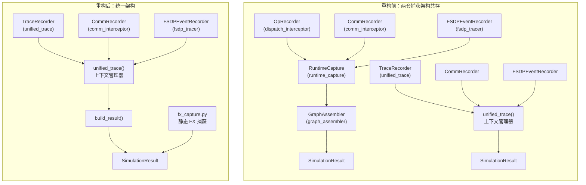
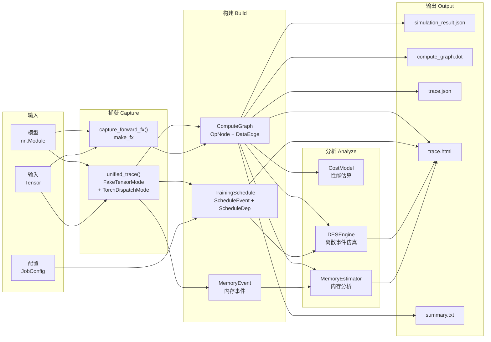
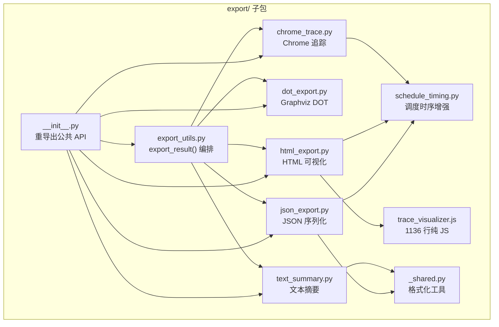

# TorchTitan 模拟器重构设计文档

## 概述

对 `torchtitan/experiments/simulator/` 进行系统性重构，在保持所有功能不变、E2E 用例正常可运行、输出内容不发生变化的前提下，提升代码可读性、可维护性和可扩展性。

**策略：** 分层增量重构（自底向上，4 个阶段），每个阶段独立可测试、可验证。

## 约束条件

- 所有 E2E 测试必须通过，测试断言不做修改
- 所有输出文件（JSON、DOT、Chrome trace、HTML、text）内容必须一致
- 公共 API（`__init__.py` 导出）保持不变
- 不修改 `torchtitan/experiments/simulator/` 之外的核心代码
- 每个阶段完成后 pre-commit 检查必须通过

---

## 重构前后对比

| 指标 | 重构前 | 重构后 | 变化 |
|------|--------|--------|------|
| 总行数 | ~13,500 | ~9,400 (不含测试) | **-30%** |
| 最大 Python 文件 | `export.py` 2,367 行 | `schedule_extract.py` 875 行 | **-63%** |
| 重复逻辑 | 12 处 | 0 处 | **消除** |
| 循环依赖 | 2 对 | 0 对 | **消除** |
| 捕获架构 | 2 套共存 | 1 套统一 | **统一** |
| 文件数量 | 25 个 | 22 个 + 1 子包 | 更聚焦 |

### 删除的文件

| 文件 | 原因 |
|------|------|
| `dispatch_interceptor.py` | 被 `unified_trace.py` 替代 |
| `runtime_capture.py` | 被 `unified_trace()` 上下文管理器替代 |
| `graph_assembler.py` | 合并到 `fx_capture.py` |
| `pp_schedule_extractor.py` | 合并到 `schedule_extract.py` |

### 新增的文件

| 文件 | 职责 |
|------|------|
| `_recorder_registry.py` | 记录器栈管理，打破循环依赖 |
| `cost_estimators.py` | FLOPs/字节估算 + 重叠策略 |
| `schedule_analysis.py` | 调度-图关联 + 关键路径分析 |
| `des_memory.py` | DES 内存时间线 |
| `synthetic_comm.py` | 合成通信事件注入 |
| `schedule_inject.py` | 语义调度注入 + 并行度工具 |
| `export/` 子包 | 9 个 Python 模块 + 独立 JS 文件 |

---

## 架构总览



---

## 模块依赖图



### 重构前循环依赖（已消除）



---

## 统一捕获架构



---

## 数据流图



---

## export/ 子包结构



---

## 重构阶段与提交记录

### 阶段 1：基础层 — 消除重复

| 提交 | 说明 |
|------|------|
| `1a034a5c` | 合并设备环境补丁（cpu_env + meta_env 共享工厂） |
| `1b0fdb22` | 提取共享工具函数（loss、export、dtype、并行度） |
| `ec447ebd` | 提取 comm_event_to_op_node 和 replicate_events_to_ranks |

### 阶段 2：捕获层 — 统一架构

| 提交 | 说明 |
|------|------|
| `7a74c4d9` | 创建 _recorder_registry 打破循环依赖 |
| `fd6d1b77` | 迁移 simulate_runtime 到 unified_trace，删除旧路径 |

### 阶段 3：分析层 — 拆分与解耦

| 提交 | 说明 |
|------|------|
| `c46f4211` | 拆分 cost_model → cost_estimators + schedule_analysis |
| `7437a63c` | 提取 compute_des_memory_timeline → des_memory |
| `e4d22993` | 合并 pp_schedule_extractor → schedule_extract |

### 阶段 4：输出层 — 拆分 export.py

| 提交 | 说明 |
|------|------|
| `9b776b02` | 拆分 export.py → export/ 子包，提取 JS 为独立文件 |

---

## 最终文件结构

```
torchtitan/experiments/simulator/
  __init__.py                     (82 行, 公共 API)
  _recorder_registry.py           (23 行, 记录器栈)
  simulator.py                    (431 行, Simulator 类)
  trainer.py                      (229 行, SimulationTrainer)
  trainer_runner.py               (224 行, 仿真编排)
  run_simulate.py                 (303 行, CLI 入口)
  cpu_env.py                      (219 行, CPU 环境 + 共享补丁)
  meta_env.py                     (58 行, Meta 设备薄封装)
  nodes.py                        (493 行, 数据模型)
  op_classification.py            (127 行, 算子分类)
  unified_trace.py                (434 行, 统一追踪 + compute_loss)
  comm_interceptor.py             (437 行, 通信拦截)
  fsdp_tracer.py                  (186 行, FSDP 追踪)
  fx_capture.py                   (415 行, FX 捕获 + merge_comm_events)
  cost_model.py                   (303 行, CostModel ABC + MockCostModel)
  cost_estimators.py              (183 行, FLOPs/字节估算)
  schedule_analysis.py            (136 行, 关键路径 + 多 rank 预测)
  des_engine.py                   (463 行, DES 引擎核心)
  des_memory.py                   (196 行, DES 内存时间线)
  memory_estimator.py             (355 行, 内存估算)
  schedule_extract.py             (875 行, 调度提取 + PPScheduleExtractor)
  schedule_generator.py           (379 行, 语义调度生成)
  schedule_inject.py              (68 行, 调度注入 + 并行度)
  synthetic_comm.py               (263 行, 合成通信注入)
  extension_hooks.py              (46 行, 扩展钩子)
  synthetic_dataloader.py         (57 行, 合成数据加载器)
  export/                         (子包)
    __init__.py                   (重导出公共 API)
    _shared.py                    (格式化工具)
    json_export.py                (JSON 导出)
    dot_export.py                 (DOT 导出)
    chrome_trace.py               (Chrome 追踪导出)
    html_export.py                (HTML 可视化导出)
    text_summary.py               (文本摘要)
    schedule_timing.py            (调度时序增强)
    export_utils.py               (export_result 编排)
    trace_visualizer.js           (1136 行, 独立 JS 可视化)
  llama3/                         (模型配置, 不变)
  deepseek_v4/                    (模型配置, 不变)
  tests/
    test_simulator.py             (2968 行, 114 个测试)
```

---

## 验证结果

| 检查项 | 结果 |
|--------|------|
| 单元测试 | **114/114 通过** (2.85s) |
| 公共 API | **18 个符号全部不变** |
| Pre-commit | **零新增错误** |
| 最大 Python 文件 | 875 行 (schedule_extract.py) |
| 最大 JS 文件 | 1136 行 (trace_visualizer.js, 纯 JS 可独立编辑) |
