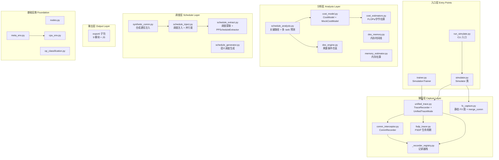
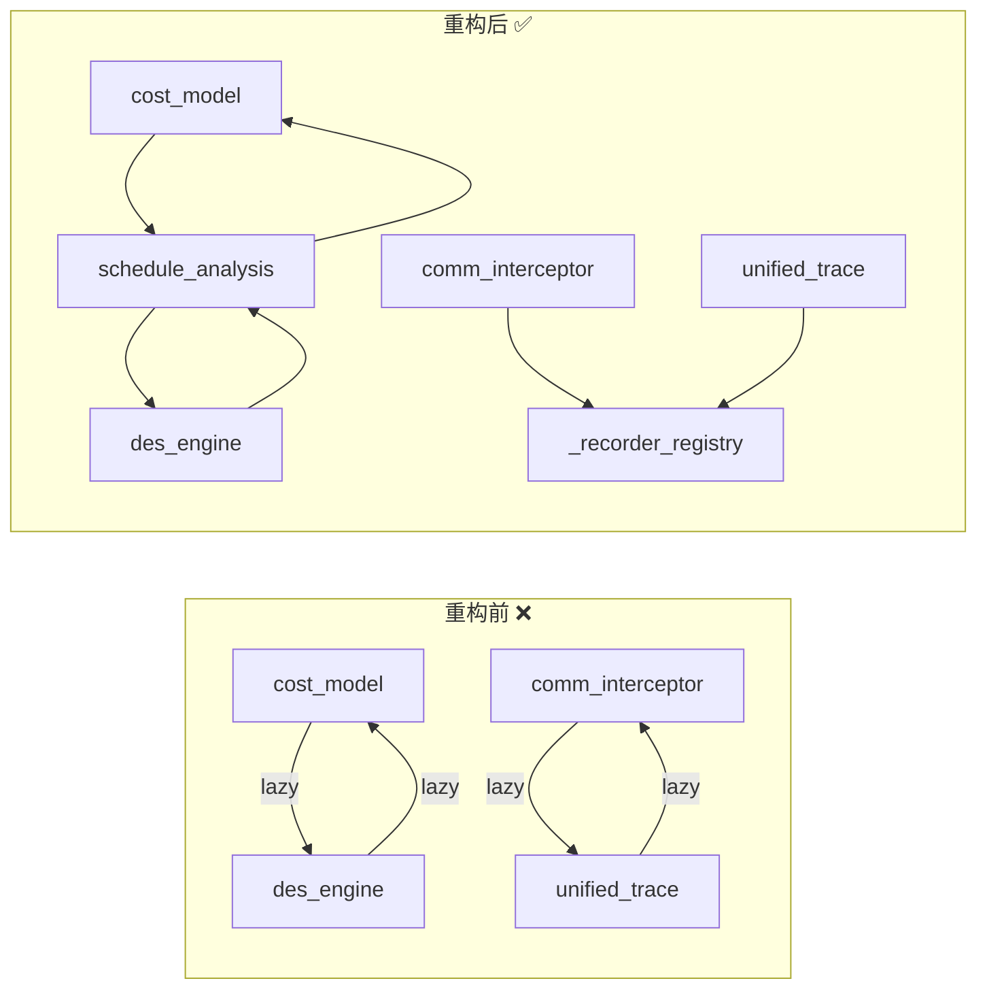
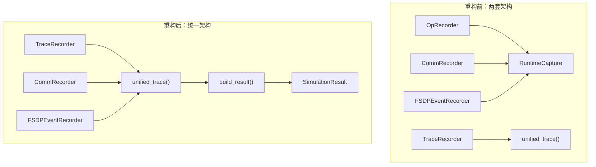

# TorchTitan 模拟器重构设计文档

## 概述

对 `torchtitan/experiments/simulator/` 进行系统性重构，在保持所有功能不变、E2E 用例正常可运行、输出内容不发生变化的前提下，提升代码可读性、可维护性和可扩展性。

**策略：** 分层增量重构（自底向上，4 个阶段），每个阶段独立可测试、可验证。

**基线：** 基于 `origin/main` 最新提交 `8cc22cfb`（含 PP 多阶段追踪、关键路径优化、大结果紧凑导出等新特性）。

---

## 重构前后对比

| 指标 | 重构前 | 重构后 | 变化 |
|------|--------|--------|------|
| 总行数（含测试+JS） | ~13,800 | ~13,000 | -6% |
| 总行数（仅源码，不含测试+JS） | ~10,800 | ~8,700 | **-19%** |
| 最大 Python 文件 | `export.py` 2,441 行 | `schedule_extract.py` 879 行 | **-64%** |
| 重复逻辑 | 12 处 | 0 处 | **消除** |
| 循环依赖 | 2 对 | 0 对 | **消除** |
| 捕获架构 | 2 套共存 | 1 套统一 | **统一** |

### 删除的文件

| 文件 | 原因 |
|------|------|
| `dispatch_interceptor.py` | 被 `unified_trace.py` 替代 |
| `runtime_capture.py` | 被 `unified_trace()` 上下文管理器替代 |
| `graph_assembler.py` | 合并到 `fx_capture.py` |
| `pp_schedule_extractor.py` | 合并到 `schedule_extract.py` |

### 新增的文件

| 文件 | 职责 |
|------|------|
| `_recorder_registry.py` | 记录器栈管理，打破循环依赖 |
| `cost_estimators.py` | FLOPs/字节估算 + 重叠策略 |
| `schedule_analysis.py` | 调度-图关联 + 关键路径分析 |
| `des_memory.py` | DES 内存时间线 |
| `synthetic_comm.py` | 合成通信事件注入 |
| `schedule_inject.py` | 语义调度注入 + 并行度工具 |
| `export/` 子包 | 9 个 Python 模块 + 独立 JS 文件 |

---

## 架构总览


```mermaid
graph TB
    subgraph "入口层 Entry Points"
        A1["simulator.py<br/>Simulator 类"]
        A2["trainer.py<br/>SimulationTrainer"]
        A3["run_simulate.py<br/>CLI 入口"]
    end

    subgraph "捕获层 Capture Layer"
        B1["unified_trace.py<br/>TraceRecorder + UnifiedTraceMode"]
        B2["comm_interceptor.py<br/>CommRecorder"]
        B3["fsdp_tracer.py<br/>FSDP 生命周期"]
        B4["fx_capture.py<br/>静态 FX 图 + merge_comm"]
        B5["_recorder_registry.py<br/>记录器栈"]
    end

    subgraph "分析层 Analysis Layer"
        C1["cost_model.py<br/>CostModel + MockCostModel"]
        C2["cost_estimators.py<br/>FLOPs/字节估算"]
        C3["schedule_analysis.py<br/>关键路径 + 多 rank 预测"]
        C4["des_engine.py<br/>离散事件仿真"]
        C5["des_memory.py<br/>内存时间线"]
        C6["memory_estimator.py<br/>内存估算"]
    end

    subgraph "调度层 Schedule Layer"
        D1["schedule_extract.py<br/>调度提取 + PPScheduleExtractor"]
        D2["schedule_generator.py<br/>语义调度生成"]
        D3["schedule_inject.py<br/>调度注入 + 并行度"]
        D4["synthetic_comm.py<br/>合成通信注入"]
    end

    subgraph "输出层 Output Layer"
        E1["export/ 子包<br/>9 模块 + JS"]
    end

    subgraph "基础设施 Foundation"
        F1["nodes.py"]
        F2["op_classification.py"]
        F3["cpu_env.py"]
        F4["meta_env.py"]
    end

    A1 --> B1
    A1 --> B4
    A2 --> B1
    A3 --> A1
    B1 --> B2
    B1 --> B3
    B1 --> B5
    B2 --> B5
    C1 --> C2
    C3 --> C1
    C3 --> C4
    D3 --> D1
    D4 --> D3
    F4 --> F3
```

---

## 循环依赖消除


```mermaid
graph LR
    subgraph "重构前 ❌"
        A1["cost_model"] -->|"lazy"| A2["des_engine"]
        A2 -->|"lazy"| A1
        B1["comm_interceptor"] -->|"lazy"| B2["unified_trace"]
        B2 -->|"lazy"| B1
    end

    subgraph "重构后 ✅"
        C1["cost_model"] --> C2["schedule_analysis"]
        C3["des_engine"] --> C2
        C2 --> C1
        C2 --> C3
        D1["comm_interceptor"] --> D2["_recorder_registry"]
        D3["unified_trace"] --> D2
    end
```

---

## 统一捕获架构


```mermaid
flowchart TD
    subgraph "重构前：两套架构"
        OLD1["OpRecorder"] --> OLD2["RuntimeCapture"]
        OLD3["CommRecorder"] --> OLD2
        OLD4["FSDPEventRecorder"] --> OLD2
        NEW1["TraceRecorder"] --> NEW2["unified_trace()"]
    end

    subgraph "重构后：统一架构"
        U1["TraceRecorder"] --> U2["unified_trace()"]
        U3["CommRecorder"] --> U2
        U4["FSDPEventRecorder"] --> U2
        U2 --> U5["build_result()"]
        U5 --> U6["SimulationResult"]
    end
```

---

## 重构阶段与提交记录

| 阶段 | 提交 | 说明 |
|------|------|------|
| **1. 基础层** | `f7f5ef6a` | 合并设备环境补丁（cpu_env + meta_env 共享工厂） |
| | `dd447185` | 提取共享工具函数（loss、export、dtype、并行度） |
| | `4f0a3ca4` | 提取 comm_event_to_op_node 和 replicate_events_to_ranks |
| **2. 捕获层** | `c29336cc` | 创建 _recorder_registry 打破循环依赖 |
| | `611c8f6b` | 迁移 simulate_runtime 到 unified_trace，删除旧路径 |
| **3. 分析层** | `a0b55e73` | 拆分 cost_model → cost_estimators + schedule_analysis |
| | `5965baef` | 提取 compute_des_memory_timeline → des_memory |
| | `3f2181e7` | 合并 pp_schedule_extractor → schedule_extract |
| **4. 输出层** | `29de31d2` | 拆分 export.py → export/ 子包，提取 JS 为独立文件 |

---

## 最终文件结构

```
torchtitan/experiments/simulator/
  __init__.py                     (82 行, 公共 API)
  _recorder_registry.py           (23 行, 记录器栈)
  simulator.py                    (428 行, Simulator 类)
  trainer.py                      (355 行, SimulationTrainer)
  trainer_runner.py               (401 行, 仿真编排)
  run_simulate.py                 (298 行, CLI 入口)
  cpu_env.py                      (213 行, CPU 环境 + 共享补丁)
  meta_env.py                     (46 行, Meta 设备薄封装)
  nodes.py                        (497 行, 数据模型)
  op_classification.py            (127 行, 算子分类)
  unified_trace.py                (468 行, 统一追踪 + compute_loss)
  comm_interceptor.py             (437 行, 通信拦截)
  fsdp_tracer.py                  (186 行, FSDP 追踪)
  fx_capture.py                   (413 行, FX 捕获 + merge_comm)
  cost_model.py                   (296 行, CostModel + MockCostModel)
  cost_estimators.py              (209 行, FLOPs/字节估算)
  schedule_analysis.py            (173 行, 关键路径 + 多 rank 预测)
  des_engine.py                   (466 行, DES 引擎核心)
  des_memory.py                   (196 行, DES 内存时间线)
  memory_estimator.py             (355 行, 内存估算)
  schedule_extract.py             (879 行, 调度提取 + PPScheduleExtractor)
  schedule_generator.py           (383 行, 语义调度生成)
  schedule_inject.py              (68 行, 调度注入 + 并行度)
  synthetic_comm.py               (262 行, 合成通信注入)
  extension_hooks.py              (46 行, 扩展钩子)
  synthetic_dataloader.py         (57 行, 合成数据加载器)
  export/                         (子包)
    __init__.py                   (重导出公共 API)
    _shared.py                    (格式化工具)
    json_export.py                (JSON 导出)
    dot_export.py                 (DOT 导出)
    chrome_trace.py               (Chrome 追踪导出)
    html_export.py                (HTML 可视化导出)
    text_summary.py               (文本摘要)
    schedule_timing.py            (调度时序增强)
    export_utils.py               (export_result 编排)
    trace_visualizer.js           (1136 行, 独立 JS 可视化)
  llama3/                         (模型配置, 不变)
  deepseek_v4/                    (模型配置, 不变)
  tests/
    test_simulator.py             (114 个测试)
```

---

## 验证结果

| 检查项 | 结果 |
|--------|------|
| 单元测试 | **114/114 通过** (3.07s) |
| 公共 API | **18 个符号全部不变** |
| 最大 Python 文件 | 879 行 (schedule_extract.py) |
| 最大 JS 文件 | 1136 行 (trace_visualizer.js, 纯 JS) |
